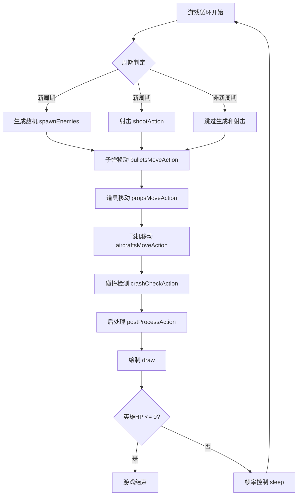
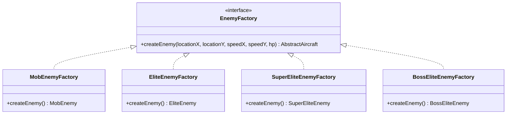
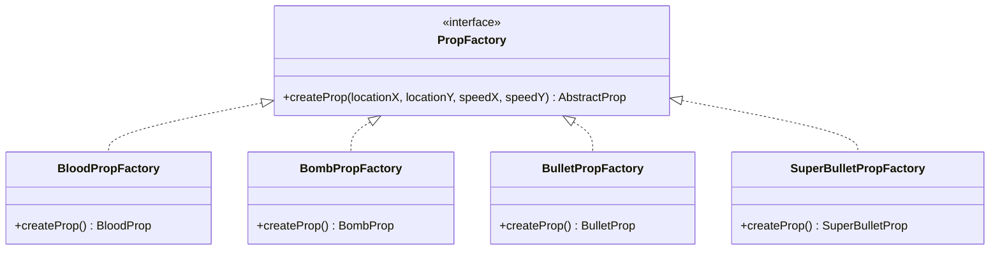
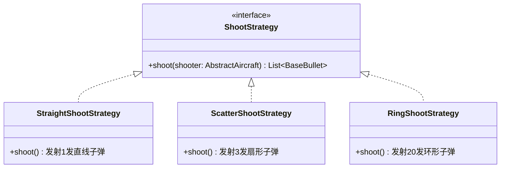
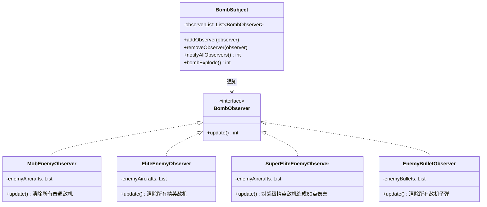
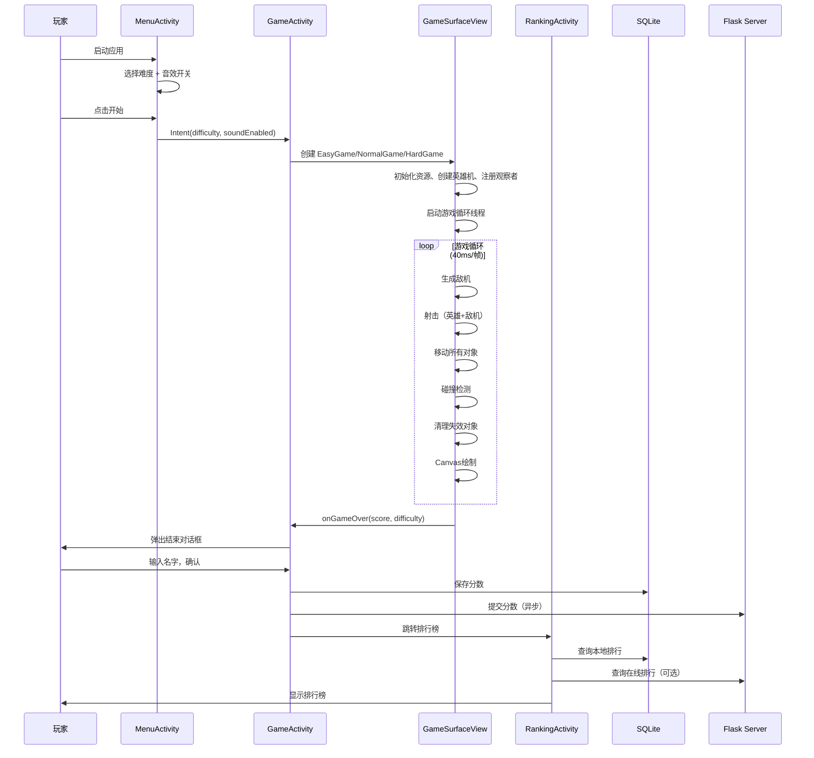

# 飞机大战 Android 项目说明文档

## 一、项目概述

**飞机大战（AircraftWar）** 是一款基于 Android 平台的经典纵向卷轴射击游戏。项目采用 Java 语言开发，使用 `SurfaceView` 实现高性能游戏渲染，支持三种难度模式、多种敌机与道具类型、本地/在线排行榜系统，并配备完整的音效系统。

### 技术栈

| 技术 | 说明 |
|------|------|
| 语言 | Java 8 |
| 平台 | Android（minSdk 26，targetSdk 34） |
| 渲染 | SurfaceView + Canvas |
| 数据库 | SQLite（本地排行榜） |
| 网络 | OkHttp 4.11.0（在线排行榜） |
| JSON | Gson 2.10.1 |
| UI | Material Design + RecyclerView |
| CI/CD | GitHub Actions（自动构建APK） |

### 项目结构

```
AircraftWarAndroid/
├── app/src/main/
│   ├── AndroidManifest.xml              # 应用清单
│   ├── java/edu/hitsz/aircraftwar/
│   │   ├── activity/                    # Activity层（UI界面）
│   │   │   ├── MenuActivity.java        # 主菜单
│   │   │   ├── GameActivity.java        # 游戏界面
│   │   │   └── RankingActivity.java     # 排行榜界面
│   │   ├── application/                 # 游戏核心层
│   │   │   ├── GameSurfaceView.java     # 游戏主逻辑（抽象基类）
│   │   │   ├── EasyGame.java            # 简单模式
│   │   │   ├── NormalGame.java          # 普通模式
│   │   │   ├── HardGame.java            # 困难模式
│   │   │   ├── GameConfig.java          # 游戏配置（屏幕适配）
│   │   │   └── ImageManager.java        # 图片资源管理
│   │   ├── basic/                       # 基础对象层
│   │   │   └── AbstractFlyingObject.java # 飞行物体基类
│   │   ├── aircraft/                    # 飞机模块
│   │   │   ├── AbstractAircraft.java    # 飞机抽象类
│   │   │   ├── HeroAircraft.java        # 英雄机（单例）
│   │   │   ├── MobEnemy.java            # 普通敌机
│   │   │   ├── EliteEnemy.java          # 精英敌机
│   │   │   ├── SuperEliteEnemy.java     # 超级精英敌机
│   │   │   └── BossEliteEnemy.java      # Boss敌机
│   │   ├── bullet/                      # 子弹模块
│   │   │   ├── BaseBullet.java          # 子弹基类
│   │   │   ├── HeroBullet.java          # 英雄子弹
│   │   │   └── EnemyBullet.java         # 敌机子弹
│   │   ├── prop/                        # 道具模块
│   │   │   ├── AbstractProp.java        # 道具基类
│   │   │   ├── BloodProp.java           # 回血道具
│   │   │   ├── BombProp.java            # 炸弹道具
│   │   │   ├── BulletProp.java          # 散射子弹道具
│   │   │   ├── SuperBulletProp.java     # 环形子弹道具
│   │   │   ├── PropEffectManager.java   # 道具效果管理器（单例）
│   │   │   └── PropEffectTask.java      # 道具效果定时任务
│   │   ├── factory/                     # 工厂模块
│   │   │   ├── EnemyFactory.java        # 敌机工厂接口
│   │   │   ├── MobEnemyFactory.java     # 普通敌机工厂
│   │   │   ├── EliteEnemyFactory.java   # 精英敌机工厂
│   │   │   ├── SuperEliteEnemyFactory.java # 超级精英敌机工厂
│   │   │   ├── BossEliteEnemyFactory.java  # Boss敌机工厂
│   │   │   ├── PropFactory.java         # 道具工厂接口
│   │   │   ├── BloodPropFactory.java    # 回血道具工厂
│   │   │   ├── BombPropFactory.java     # 炸弹道具工厂
│   │   │   ├── BulletPropFactory.java   # 散射子弹道具工厂
│   │   │   └── SuperBulletPropFactory.java # 环形子弹道具工厂
│   │   ├── strategy/                    # 策略模块
│   │   │   ├── ShootStrategy.java       # 射击策略接口
│   │   │   ├── StraightShootStrategy.java # 直射策略
│   │   │   ├── ScatterShootStrategy.java  # 散射策略
│   │   │   └── RingShootStrategy.java   # 环形射击策略
│   │   ├── observer/                    # 观察者模块
│   │   │   ├── BombObserver.java        # 炸弹观察者接口
│   │   │   ├── BombSubject.java         # 炸弹主题（被观察者）
│   │   │   ├── MobEnemyObserver.java    # 普通敌机观察者
│   │   │   ├── EliteEnemyObserver.java  # 精英敌机观察者
│   │   │   ├── SuperEliteEnemyObserver.java # 超级精英敌机观察者
│   │   │   └── EnemyBulletObserver.java # 敌机子弹观察者
│   │   ├── dao/                         # 数据访问层
│   │   │   ├── Score.java               # 分数实体类
│   │   │   ├── ScoreDao.java            # 分数DAO接口
│   │   │   └── ScoreDaoImpl.java        # 分数DAO实现（SQLite）
│   │   └── network/                     # 网络模块
│   │       └── OnlineRankingManager.java # 在线排行榜管理器
│   └── res/                             # 资源文件
│       ├── drawable/                    # 图片资源（飞机、子弹、道具、背景）
│       ├── layout/                      # 布局文件
│       ├── raw/                         # 音效资源（BGM、音效）
│       └── values/                      # 主题、颜色、字符串
├── .github/workflows/build-apk.yml      # GitHub Actions CI/CD
└── build.gradle                         # Gradle构建配置
```

---

## 二、模块详解

### 2.1 Activity 层（`activity` 包）

Activity 层负责 Android 界面管理和生命周期控制，是用户与游戏交互的入口。

#### 2.1.1 MenuActivity — 主菜单

**文件**: `MenuActivity.java`

**功能**:
- 提供三种难度选择按钮（简单/普通/困难）
- 音效开关选择（Spinner 下拉框）
- 排行榜入口按钮
- 按钮入场动画（从下方弹入，带 OvershootInterpolator 弹性效果）
- 按钮按压缩放反馈动画

**实现方式**:
- 使用 `setContentView(R.layout.activity_menu)` 加载 XML 布局
- 通过 `Intent` 传递难度参数和音效开关到 `GameActivity`
- 使用 Android 属性动画（`ObjectAnimator`）实现 UI 动效
- 设置全屏沉浸式模式（`SYSTEM_UI_FLAG_FULLSCREEN`）

#### 2.1.2 GameActivity — 游戏界面

**文件**: `GameActivity.java`

**功能**:
- 承载 `GameSurfaceView` 游戏画面
- 根据难度参数创建对应的游戏实例（EasyGame/NormalGame/HardGame）
- 管理游戏生命周期（暂停/销毁时停止游戏）
- 游戏结束后弹出对话框，输入玩家名并保存分数
- 分数同时保存到本地 SQLite 和在线排行榜
- 实现沉浸式全屏（兼容 Android 11+ 和旧版本）

**实现方式**:
- 通过 `switch-case` 根据难度字符串创建不同的 `GameSurfaceView` 子类实例
- 使用 `AlertDialog` 弹出游戏结束对话框
- 使用 `WindowInsetsController`（Android 11+）或 `setSystemUiVisibility`（旧版）实现全屏
- 保持屏幕常亮（`FLAG_KEEP_SCREEN_ON`）

#### 2.1.3 RankingActivity — 排行榜界面

**文件**: `RankingActivity.java`

**功能**:
- 显示本地排行榜（按难度筛选）
- 支持在线排行榜查看
- 难度切换（Spinner 下拉选择）
- 选中记录后可删除
- 服务器连接状态检测与显示
- 长按「在线排行」按钮可配置服务器地址（IP + 端口）

**实现方式**:
- 使用 `RecyclerView` + 自定义 `ScoreAdapter` 展示排行榜列表
- 通过 `ScoreDao` 接口查询本地数据
- 通过 `OnlineRankingManager` 获取在线数据
- 选中高亮通过 `setBackgroundColor` 实现

---

### 2.2 游戏核心层（`application` 包）

游戏核心层是整个项目的心脏，包含游戏主循环、渲染引擎、难度配置和资源管理。

#### 2.2.1 GameSurfaceView — 游戏主逻辑（抽象基类）

**文件**: `GameSurfaceView.java`（771行，项目最核心的文件）

**功能**:
- **游戏主循环**: 在独立线程中以 40ms 间隔（约25FPS）运行游戏循环
- **敌机生成**: 周期性生成普通敌机、精英敌机、超级精英敌机和Boss
- **射击系统**: 英雄机和敌机的自动射击逻辑
- **碰撞检测**: 子弹与飞机、飞机与飞机、英雄与道具的碰撞判定
- **道具系统**: 击杀敌机后随机掉落道具，拾取后触发效果
- **触屏控制**: 拖拽跟随模式控制英雄机移动（防闪现）
- **画面渲染**: 使用 Canvas 绘制背景滚动、所有游戏对象、HUD信息
- **音效系统**: BGM播放、Boss音乐切换、射击/爆炸/拾取音效
- **游戏结束**: 英雄机HP归零时触发结束回调

**游戏主循环流程**:



**触屏控制实现**:
- `ACTION_DOWN`: 记录手指按下的屏幕像素坐标，不移动英雄机（防止闪现）
- `ACTION_MOVE`: 计算手指在屏幕上的像素增量，转换为逻辑坐标增量后应用到英雄机位置，并做边界限制
- `ACTION_UP`: 重置触摸状态

#### 2.2.2 EasyGame / NormalGame / HardGame — 难度子类

**文件**: `EasyGame.java`、`NormalGame.java`、`HardGame.java`

这三个类继承自 `GameSurfaceView`，通过实现抽象方法来定义不同难度的游戏参数：

| 参数 | 简单模式 | 普通模式 | 困难模式 |
|------|---------|---------|---------|
| 最大敌机数 | 3 | 5 | 7 |
| 敌机速度倍率 | 0.7（固定） | 1.0 ~ 2.5（递增） | 1.0 ~ 2.0（递增） |
| 英雄初始HP | 1000 | 1500 | 1000 |
| 精英敌机生成率 | 0.2（固定） | 0.3 ~ 0.7（递增） | 0.45 ~ 0.85（递增） |
| Boss分数阈值 | 无Boss | 500 | 400 |
| Boss初始HP | 0 | 270 | 270 |
| Boss HP递增 | 0 | 0 | 60（每次+60） |

普通模式和困难模式的速度和生成率会随游戏时间递增（每30秒提升一个等级，最高10级）。

#### 2.2.3 GameConfig — 游戏配置

**文件**: `GameConfig.java`

**功能**:
- 定义逻辑坐标系（宽度固定512，高度根据屏幕比例动态计算）
- 计算屏幕缩放比例（`SCALE_X`、`SCALE_Y`）
- 支持不同屏幕比例的动态适配，消除黑边

**实现方式**:
- `init(screenWidth, screenHeight)` 方法在 `surfaceCreated` 时调用
- 逻辑高度 = 512 × (屏幕高度 / 屏幕宽度)，保证画面填满整个屏幕
- 缩放比例 = 实际屏幕尺寸 / 逻辑尺寸

#### 2.2.4 ImageManager — 图片资源管理

**文件**: `ImageManager.java`

**功能**:
- 统一加载和管理所有游戏图片资源（Bitmap）
- 将原始图片缩放到逻辑坐标系下的合理尺寸
- 通过类名映射快速获取对应图片
- 根据难度加载不同的背景图片

**实现方式**:
- 使用 `BitmapFactory.decodeResource()` 从 drawable 加载图片
- 使用 `Bitmap.createScaledBitmap()` 缩放到目标尺寸
- 使用 `HashMap<String, Bitmap>` 建立类名到图片的映射
- 提供 `get(Object obj)` 方法，通过对象的类名自动查找图片

---

### 2.3 基础对象层（`basic` 包）

#### 2.3.1 AbstractFlyingObject — 飞行物体基类

**文件**: `AbstractFlyingObject.java`

**功能**:
- 定义所有飞行物体的公共属性：位置（locationX/Y）、速度（speedX/Y）、图片、尺寸、有效标记
- 提供 `forward()` 方法实现基础移动逻辑（触碰横向边界时速度反向）
- 提供 `crash()` 方法实现矩形碰撞检测（飞机类使用更大的碰撞区域）
- 提供 `vanish()` 方法标记对象失效

**碰撞检测算法**:
- 基于 AABB（轴对齐包围盒）碰撞检测
- 飞机类对象的碰撞区域为高度的一半（`factor = 2`），使碰撞判定更合理

---

### 2.4 飞机模块（`aircraft` 包）

#### 2.4.1 AbstractAircraft — 飞机抽象类

**文件**: `AbstractAircraft.java`

**功能**:
- 继承 `AbstractFlyingObject`，增加 HP 系统（当前HP、最大HP）
- 持有射击策略引用（`ShootStrategy`），支持运行时切换
- 提供 `decreaseHp()` / `increaseHp()` 方法管理生命值
- 提供 `shoot()` 方法委托给策略对象执行

#### 2.4.2 HeroAircraft — 英雄机（单例模式）

**文件**: `HeroAircraft.java`

**功能**:
- 玩家操控的英雄飞机，全局唯一实例
- 默认使用直射策略，可切换为散射或环形射击
- `forward()` 方法为空（由触屏控制移动）
- 提供 `resetInstance()` 方法用于游戏重新开始

**射击策略切换规则**:
- 默认：`StraightShootStrategy`（直射）
- 拾取子弹道具：切换为 `ScatterShootStrategy`（散射，3发）
- 拾取超级子弹道具：切换为 `RingShootStrategy`（环形，20发）
- 环形射击优先级高于散射（拾取散射道具时若当前为环形则不切换）

#### 2.4.3 敌机类型

| 类名 | 说明 | 射击策略 | 特点 |
|------|------|---------|------|
| `MobEnemy` | 普通敌机 | 无（不射击） | 仅向下移动，飞出屏幕消失 |
| `EliteEnemy` | 精英敌机 | 直射（StraightShoot） | 可射击，击杀后掉落道具 |
| `SuperEliteEnemy` | 超级精英敌机 | 散射（ScatterShoot） | 更高HP，散射攻击，击杀后掉落道具 |
| `BossEliteEnemy` | Boss敌机 | 环形射击（RingShoot） | 高HP，环形弹幕，击杀后掉落多个道具 |

---

### 2.5 子弹模块（`bullet` 包）

#### 2.5.1 BaseBullet — 子弹基类

**文件**: `BaseBullet.java`

**功能**:
- 继承 `AbstractFlyingObject`，增加攻击力（`power`）属性
- 重写 `forward()` 方法，子弹飞出屏幕边界时自动消失

#### 2.5.2 HeroBullet / EnemyBullet

- `HeroBullet`: 英雄机发射的子弹，向上飞行
- `EnemyBullet`: 敌机发射的子弹，向下飞行
- 两者仅类型不同，用于碰撞检测时区分阵营

---

### 2.6 道具模块（`prop` 包）

#### 2.6.1 道具类型

| 类名 | 说明 | 效果 |
|------|------|------|
| `BloodProp` | 回血道具 | 英雄机恢复30点HP |
| `BombProp` | 炸弹道具 | 触发炸弹爆炸，清除屏幕上所有普通/精英敌机和敌机子弹 |
| `BulletProp` | 散射子弹道具 | 英雄机切换为散射模式（3发），持续12秒 |
| `SuperBulletProp` | 环形子弹道具 | 英雄机切换为环形射击模式（20发），持续12秒 |

**掉落概率**: 精英/超级精英敌机击杀后80%概率掉落道具，Boss击杀后90%概率掉落1~3个道具。

**道具分配概率**: 回血25% / 炸弹25% / 散射子弹30% / 环形子弹20%

#### 2.6.2 PropEffectManager — 道具效果管理器（单例模式）

**文件**: `PropEffectManager.java`

**功能**:
- 管理英雄机的临时射击增强效果
- 支持散射效果和环形效果的激活与自动过期
- 环形效果优先级高于散射效果
- 效果到期后自动恢复为直射模式

**实现方式**:
- 使用 `volatile long effectEndTime` 记录效果结束时间
- 启动守护线程（`PropEffectTask`）每100ms检查一次是否到期
- 到期后调用 `endEffect()` 恢复直射策略

#### 2.6.3 PropEffectTask — 道具效果定时任务

**文件**: `PropEffectTask.java`

- 实现 `Runnable` 接口
- 在守护线程中循环检查效果是否到期
- 到期后调用 `PropEffectManager.endEffect()` 结束效果

---

### 2.7 工厂模块（`factory` 包）

工厂模块使用 **工厂方法模式** 封装游戏对象的创建逻辑。

#### 2.7.1 敌机工厂



#### 2.7.2 道具工厂



---

### 2.8 策略模块（`strategy` 包）

策略模块使用 **策略模式** 实现不同的射击行为，使飞机的射击方式可以在运行时动态切换。

#### 2.8.1 射击策略



| 策略 | 子弹数 | 方向 | 攻击力（英雄/敌机） |
|------|--------|------|---------------------|
| `StraightShootStrategy` | 1发 | 正前方直线 | 30 / 10 |
| `ScatterShootStrategy` | 3发 | 扇形（speedX: -2, 0, 2） | 30 / 10 |
| `RingShootStrategy` | 20发 | 360°均匀分布 | 25 / 10 |

**实现细节**:
- 每个策略通过 `instanceof HeroAircraft` 判断射击者阵营，决定子弹类型（`HeroBullet`/`EnemyBullet`）和飞行方向
- 子弹速度基于射击者的 `speedY` 加上固定偏移量

---

### 2.9 观察者模块（`observer` 包）

观察者模块使用 **观察者模式** 实现炸弹道具的全屏清除效果。

#### 2.9.1 架构



**工作流程**:
1. 英雄机拾取 `BombProp` 后，调用 `bombSubject.bombExplode()`
2. `BombSubject` 遍历所有注册的观察者，调用 `update()` 方法
3. 各观察者执行对应的清除/伤害逻辑，并返回获得的分数
4. 总分数累加到玩家得分

**各观察者行为**:
| 观察者 | 行为 | 返回分数 |
|--------|------|---------|
| `MobEnemyObserver` | 消灭所有普通敌机 | 每个+10分 |
| `EliteEnemyObserver` | 消灭所有精英敌机 | 每个+10分 |
| `SuperEliteEnemyObserver` | 对超级精英敌机造成60点伤害（不一定击杀） | 击杀时+10分 |
| `EnemyBulletObserver` | 清除所有敌机子弹 | 0分 |

---

### 2.10 数据访问层（`dao` 包）

#### 2.10.1 Score — 分数实体类

**文件**: `Score.java`

**属性**: id（自增主键）、name（玩家名）、score（分数）、playTime（游戏时间）、difficulty（难度）

#### 2.10.2 ScoreDao / ScoreDaoImpl — 数据访问

**文件**: `ScoreDao.java`、`ScoreDaoImpl.java`

**功能**:
- 使用 SQLite 数据库存储排行榜数据
- 支持增删查操作
- 支持按难度筛选排行榜
- 查询结果按分数降序排列

**实现方式**:
- `ScoreDaoImpl` 继承 `SQLiteOpenHelper` 并实现 `ScoreDao` 接口
- 数据库名: `aircraft_war.db`，表名: `scores`
- 使用 `ContentValues` 插入数据，`Cursor` 查询数据

---

### 2.11 网络模块（`network` 包）

#### 2.11.1 OnlineRankingManager — 在线排行榜管理器

**文件**: `OnlineRankingManager.java`

**功能**:
- 连接远程 Flask 排行榜服务器
- 提交分数到服务器（POST `/api/scores`）
- 获取在线排行榜（GET `/api/ranking?difficulty=XXX`）
- 服务器健康检查（GET `/api/health`）
- 支持动态配置服务器地址（IP + 端口）

**实现方式**:
- 使用 **单例模式** 管理网络实例
- 使用 OkHttp 异步请求（`enqueue`），避免阻塞主线程
- 使用 Gson 进行 JSON 序列化/反序列化
- 通过 `Handler(Looper.getMainLooper())` 将回调切换到主线程
- 连接超时/读写超时均为5秒

---

## 三、设计模式总结

本项目共运用了 **6种** 经典设计模式：

### 3.1 模板方法模式（Template Method Pattern）

**应用位置**: `GameSurfaceView`（抽象基类）+ `EasyGame` / `NormalGame` / `HardGame`（具体子类）

**说明**: `GameSurfaceView` 定义了游戏主循环的完整算法骨架（敌机生成→射击→移动→碰撞检测→绘制），将难度相关的参数（敌机数量、速度倍率、Boss阈值等）延迟到子类中实现。子类只需重写8个抽象方法即可定义一种全新的难度模式。

```
GameSurfaceView (抽象模板)
├── getEnemyMaxNumber()        → 子类定义
├── getEnemySpeedMultiplier()  → 子类定义
├── getHeroInitialHp()         → 子类定义
├── getEliteSpawnRate()        → 子类定义
├── getHeroShootCycle()        → 子类定义
├── getBossScoreThreshold()    → 子类定义
├── getBossInitialHp()         → 子类定义
└── getBossHpIncrement()       → 子类定义
```

### 3.2 策略模式（Strategy Pattern）

**应用位置**: `ShootStrategy` 接口 + `StraightShootStrategy` / `ScatterShootStrategy` / `RingShootStrategy`

**说明**: 将射击行为封装为独立的策略对象，飞机类通过 `setShootStrategy()` 方法在运行时动态切换射击方式。英雄机拾取不同道具后可切换射击策略，不同类型的敌机在构造时设置不同的射击策略。

### 3.3 工厂方法模式（Factory Method Pattern）

**应用位置**: `EnemyFactory` / `PropFactory` 接口及其实现类

**说明**: 将敌机和道具的创建逻辑封装到工厂类中，游戏主逻辑通过工厂接口创建对象，无需关心具体类型。新增敌机或道具类型时只需添加新的工厂类，符合开闭原则。

### 3.4 观察者模式（Observer Pattern）

**应用位置**: `BombSubject`（被观察者）+ `BombObserver` 接口及其实现类

**说明**: 炸弹道具爆炸时，`BombSubject` 通知所有注册的观察者执行清除操作。不同类型的观察者负责清除不同类型的对象（普通敌机、精英敌机、超级精英敌机、敌机子弹），实现了炸弹效果与具体清除逻辑的解耦。

### 3.5 单例模式（Singleton Pattern）

**应用位置**:
- `HeroAircraft`: 英雄机全局唯一（线程安全的懒汉式，`synchronized`）
- `PropEffectManager`: 道具效果管理器全局唯一
- `OnlineRankingManager`: 网络管理器全局唯一

**说明**: 确保游戏中关键对象只有一个实例，提供全局访问点。均提供 `resetInstance()` 方法支持游戏重新开始时重置状态。

### 3.6 DAO 模式（Data Access Object Pattern）

**应用位置**: `ScoreDao`（接口）+ `ScoreDaoImpl`（SQLite实现）

**说明**: 将数据访问逻辑与业务逻辑分离。`ScoreDao` 接口定义了增删查操作，`ScoreDaoImpl` 使用 SQLite 实现。如果未来需要更换存储方式（如 Room、文件等），只需提供新的实现类，不影响上层代码。

---

## 四、整体架构图

```mermaid
graph TB
    subgraph "Activity层 (UI)"
        MA[MenuActivity<br/>主菜单]
        GA[GameActivity<br/>游戏界面]
        RA[RankingActivity<br/>排行榜]
    end

    subgraph "游戏核心层 (application)"
        GSV[GameSurfaceView<br/>游戏主逻辑 - 抽象基类]
        EG[EasyGame]
        NG[NormalGame]
        HG[HardGame]
        GC[GameConfig<br/>屏幕适配]
        IM[ImageManager<br/>图片资源]
    end

    subgraph "游戏对象层"
        AFO[AbstractFlyingObject<br/>飞行物体基类]
        AA[AbstractAircraft<br/>飞机抽象类]
        HA[HeroAircraft<br/>英雄机 - 单例]
        ME[MobEnemy]
        EE[EliteEnemy]
        SE[SuperEliteEnemy]
        BE[BossEliteEnemy]
        BB[BaseBullet<br/>子弹基类]
        AP[AbstractProp<br/>道具基类]
    end

    subgraph "设计模式层"
        SS[ShootStrategy<br/>策略模式]
        EF[EnemyFactory<br/>工厂模式]
        PF[PropFactory<br/>工厂模式]
        BS[BombSubject<br/>观察者模式]
        PEM[PropEffectManager<br/>单例模式]
    end

    subgraph "数据层"
        SD[ScoreDao<br/>DAO接口]
        SDI[ScoreDaoImpl<br/>SQLite实现]
        ORM[OnlineRankingManager<br/>网络排行榜]
    end

    MA -->|启动游戏| GA
    MA -->|查看排行| RA
    GA -->|创建| GSV
    GSV <|-- EG
    GSV <|-- NG
    GSV <|-- HG
    GSV --> GC
    GSV --> IM
    GSV --> AA
    GSV --> BB
    GSV --> AP
    GSV --> SS
    GSV --> EF
    GSV --> PF
    GSV --> BS
    GSV --> PEM
    AFO <|-- AA
    AFO <|-- BB
    AFO <|-- AP
    AA <|-- HA
    AA <|-- ME
    AA <|-- EE
    AA <|-- SE
    AA <|-- BE
    AA --> SS
    GA --> SD
    GA --> ORM
    RA --> SD
    RA --> ORM
    SD <|.. SDI
```

---

## 五、游戏流程总览



---

## 六、资源文件说明

### 6.1 图片资源（`res/drawable/`）

| 文件 | 说明 |
|------|------|
| `bg.jpg` / `bg2.jpg` / `bg3.jpg` | 简单/普通/困难模式背景 |
| `hero.png` | 英雄机 |
| `mob.png` | 普通敌机 |
| `elite.png` | 精英敌机 |
| `eliteplus.png` | 超级精英敌机 |
| `boss.png` | Boss敌机 |
| `bullet_hero.png` / `bullet_enemy.png` | 英雄/敌机子弹 |
| `prop_blood.png` / `prop_bomb.png` / `prop_bullet.png` / `prop_bulletplus.png` | 四种道具 |

### 6.2 音效资源（`res/raw/`）

| 文件 | 说明 |
|------|------|
| `bgm.wav` | 普通背景音乐 |
| `bgm_boss.wav` | Boss战背景音乐 |
| `bullet.wav` | 射击音效 |
| `bullet_hit.wav` | 子弹命中音效 |
| `bomb_explosion.wav` | 炸弹爆炸音效 |
| `get_supply.wav` | 拾取道具音效 |
| `game_over.wav` | 游戏结束音效 |

---

## 七、构建与部署

### 7.1 本地构建

```bash
cd AircraftWarAndroid
./gradlew assembleDebug    # 构建Debug版APK
./gradlew assembleRelease  # 构建Release版APK
```

APK输出路径: `app/build/outputs/apk/`

### 7.2 CI/CD

项目配置了 GitHub Actions 自动构建流水线（`.github/workflows/build-apk.yml`），在 push 到 main/master 分支时自动触发：
1. 检出代码
2. 设置 JDK 17
3. 构建 Debug 和 Release APK
4. 上传 APK 产物（保留30天）
